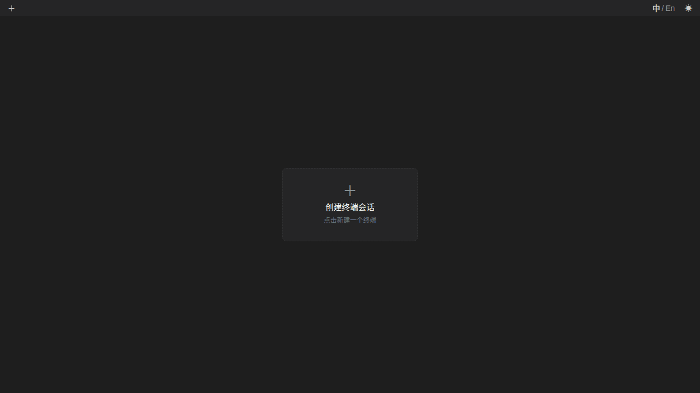

# GoTTY - Web terminals, driven end to end

**English** | [简体中文](README.zh-CN.md)

GoTTY is a command line tool that runs your CLI tools in browser-hosted
terminals: sessions are created over a REST API, attached over WebSocket
and managed as tabs in the page. `gotty capture` turns the same PTY
pipeline into an end-to-end testing command — run anything headlessly and
take the rendered result away as text, styled JSON cells or HTML,
Playwright-style.



# Features

- **Multiple sessions** — create, attach, detach and destroy terminal sessions via a REST API.
- **Terminal capture** — `gotty capture` runs any command and returns its rendered result as text, styled JSON cells or HTML; no browser, no running server.
- **Reconnection** — the process keeps running while the client is disconnected; a refresh (same id) resumes the same session.
- **Modern frontend** — Vite + Vue 3 + xterm.js with WebGL rendering and an i18n UI (中文/English).

# Installation

Download the latest binary from the [Releases](https://github.com/gausszhou/gotty/releases) page, or build from source (Go 1.26+, Node.js 18+, pnpm):

```sh
make install   # frontend dependencies
make build     # frontend + embedded static + ./build/gotty
```

# Usage

## `gotty serve` — web terminals

```sh
gotty serve top
```

Open `http://localhost:9049` and click the create card (or **＋** in the tab
bar) to create a session running the command and attach to it. Without a
command, the default session command is the login shell (`$SHELL`).

Session ids are generated **by the client** (16 base36 chars) and kept in a
per-device list in `localStorage`; the server stores records by id only and
never exposes a global list. Reloading the page never creates a session —
it reopens the most recent alive one, or shows the create card. Creating
with a known id is idempotent / **resurrects** the recorded command
(`run_count+1`); re-attaching the same id preempts the old client
(WS 1013).

## `gotty capture` — end-to-end terminal testing

The Playwright-of-terminals command: run a command, wait for the render to
settle, take the rendered result away. Two engines:

### Browser engine (recommended for pixels) — `--engine browser`

Drives a headless Chrome/Chromium against the real gotty render page and
screenshots the terminal — **what the user sees is exactly what you get**:
real fonts, CJK, emoji, and graphics-protocol images (sixel, iTerm2
inline). Needs a Chrome/Chromium (searched on PATH; `--browser-path`
points at an existing binary).

```sh
gotty capture --engine browser --format png --out shot.png -- htop
gotty capture --engine browser --format png -- sh -c 'ls -la | head -20'
```

### Native engine (fallback, no browser) — default

Runs the PTY and a built-in VT emulator in-process: no browser, no
Chromium, works on bare servers and in CI. Renders text / styled JSON
cells / HTML / a PNG bitmap. The **kitty graphics protocol is supported
here only**; in PNG output CJK/emoji glyphs render as placeholder boxes
(pixel-perfect text needs the browser engine).

```sh
gotty capture --format text -- ls -la
gotty capture --format json -- chafa --format symbols logo.png
gotty capture --format png -- sh -c 'printf "\033[41mRED\033[0m"'
```

### Common options

Both engines snapshot the screen in a fixed-size terminal
(`--cols`/`--rows`, default 120×30) when the process exits, after output
has been silent for `--wait-ms` (default 500 ms), when `--marker` appears
in the stream, or on `--timeout` (default 30 s; the screen is returned
with `timed_out` set). Use `--` before the command and `sh -c "..."` for
shell syntax. Full design: [docs/design/capture-design.md](docs/design/capture-design.md).

# Options

```
-a, --address string        IP address to listen (default: "0.0.0.0") [$GOTTY_ADDRESS]
-p, --port string           Port number to listen (default: "9049") [$GOTTY_PORT]
-w, --permit-write          Permit clients to write to the TTY (default: true — BE CAREFUL) [$GOTTY_PERMIT_WRITE]
    --title-format string   Title format of browser window (default: "GoTTY - {{ .command }}@{{ .hostname }}") [$GOTTY_TITLE_FORMAT]
    --reconnect             Enable reconnection [$GOTTY_RECONNECT]
    --reconnect-time int    Time to reconnect (default: 10) [$GOTTY_RECONNECT_TIME]
    --max-session int       Maximum number of concurrent sessions (default: 0 = unlimited) [$GOTTY_MAX_SESSION]
    --mirror                Keep a screen mirror per session for the agent API (screen/wait; default: true) [$GOTTY_MIRROR]
    --answer-queries        Answer terminal queries when no browser client is attached (default: true) [$GOTTY_ANSWER_QUERIES]
    --timeout int           Idle timeout seconds for destroying unattached sessions (default: 900, 0 = disabled) [$GOTTY_TIMEOUT]
    --session-file string   File path to persist session records (default: "~/.gotty/sessions.json", empty = disabled) [$GOTTY_SESSION_FILE]
    --title-file string     File path to persist the page title (default: "~/.gotty/title.json", empty = memory only) [$GOTTY_TITLE_FILE]
    --width int             Static width of the screen, 0(default) means dynamically resize [$GOTTY_WIDTH]
    --height int            Static height of the screen, 0(default) means dynamically resize [$GOTTY_HEIGHT]
    --ws-origin string      A regular expression that matches origin URLs to be accepted by WebSocket [$GOTTY_WS_ORIGIN]
    --term string           TERM value used inside session PTYs (default: "xterm-256color") [$GOTTY_TERM]
-t, --tls                   Enable TLS/SSL [$GOTTY_TLS]
    --tls-crt string        TLS/SSL certificate file path (default: "~/.gotty.crt") [$GOTTY_TLS_CRT]
    --tls-key string        TLS/SSL key file path (default: "~/.gotty.key") [$GOTTY_TLS_KEY]
    --log-file string       Server log file path (default: "~/.gotty/logs/gotty.log", empty = console only) [$GOTTY_LOG_FILE]
    --close-signal int      Signal sent to the command process when the session is closed (default: 1 = SIGHUP) [$GOTTY_CLOSE_SIGNAL]
    --close-timeout int     Time in seconds to force kill process after the session is closed (default: 3, -1 = wait forever) [$GOTTY_CLOSE_TIMEOUT]
    --config string         Config file path (default: "~/.gotty/config.json") [$GOTTY_CONFIG]
-v, --version               print the version
```

# Configuration & Security

GoTTY loads a JSON profile from `~/.gotty/config.json` when present
(override with `--config`; flags > config file > `GOTTY_*` env vars).
Unknown keys are ignored.

> `--permit-write` defaults to **true**: by default anyone who can reach the
> page can type into your sessions. Make sessions read-only with
> `--permit-write=false`, and protect the port with TLS (`-t`) and/or a
> reverse proxy. Traffic is unencrypted unless TLS is enabled.

# Deployment

`build/gotty` is a self-contained single binary: the web frontend is embedded
via `go:embed`, so the only thing you ship is the executable (plus nothing —
no Node, no assets directory).

## Run as a systemd (user) service

Restart-on-crash and boot startup without root. Save this unit as
`~/.config/systemd/user/gotty.service`:

```ini
[Unit]
Description=GoTTY web terminal server
After=network-online.target
Wants=network-online.target

[Service]
Type=simple
ExecStart=/path/to/build/gotty serve --address 127.0.0.1 --port 9049 --log-file ~/.gotty/logs/gotty.log --session-file ~/.gotty/sessions.json
WorkingDirectory=/path/to
Restart=on-failure
RestartSec=5
Environment=HOME=/home/you   # GoTTY expands "~" in the paths above itself

[Install]
WantedBy=default.target
```

```sh
systemctl --user daemon-reload
systemctl --user enable --now gotty.service   # start now + on boot
loginctl enable-linger $USER                  # keep running after logout
```

Then: `systemctl --user start gotty` to start, `systemctl --user status
gotty` to inspect, `journalctl --user -u gotty.service -f` to follow logs,
`systemctl --user restart gotty` after upgrading the binary.

> Session state lives in process memory. After a restart the web UI drops
> stale manifest entries and shows the create card; recorded sessions (id,
> command) can still be resurrected by creating the same id again
> (`run_count+1`).

Binding GoTTY to `127.0.0.1` means only local processes can reach it — put a
reverse proxy in front for remote access. The quick-and-dirty alternative
(no supervision) is `nohup ./build/gotty serve ... >/dev/null 2>&1 &`.

## Reverse proxy with TLS (nginx)

GoTTY upgrades to WebSockets (`WS /ws?session_id=...`), so the proxy must
forward the `Upgrade`/`Connection` headers. Example site config:

```nginx
server {
    listen 443 ssl;
    server_name tty.example.com;

    ssl_certificate     /etc/letsencrypt/live/tty.example.com/fullchain.pem;
    ssl_certificate_key /etc/letsencrypt/live/tty.example.com/privkey.pem;

    location / {
        proxy_pass http://127.0.0.1:9049;
        proxy_http_version 1.1;
        proxy_set_header Upgrade $http_upgrade;
        proxy_set_header Connection "upgrade";
        proxy_set_header Host $host;
        proxy_set_header X-Real-IP $remote_addr;
        proxy_set_header X-Forwarded-For $proxy_add_x_forwarded_for;
        proxy_read_timeout 86400;            # long-lived WebSocket
    }
}
```

```sh
sudo certbot --nginx -d tty.example.com     # obtain + auto-renew TLS
```

Instead of a proxy you can terminate TLS in GoTTY itself: `gotty serve -t`
(default certificates `~/.gotty.crt` / `~/.gotty.key`, override with
`--tls-crt` / `--tls-key`).

## Hardening checklist

- `--permit-write=false` for read-only exposure (the default is **true** —
  anyone who can open the page can type into your sessions).
- Keep GoTTY on `127.0.0.1` unless TLS terminates at GoTTY itself, and never
  expose an unencrypted, write-enabled instance on `0.0.0.0`.
- `--ws-origin '^https://tty\.example\.com$'` rejects cross-site WebSocket
  connections from other origins.
- Restrict which commands sessions may run by giving `serve` a fixed command
  (e.g. `gotty serve tmux new -A -s gotty`), see
  [Multiple Clients](#multiple-clients-one-terminal).
- TLS every deployment: either via the proxy (above) or `-t`. See also the
  [guide](apps/docs/guide/usage.md) for the full option reference.

# Multiple Clients, One Terminal

One session = one attached client; a second attach to the **same id**
preempts the first, different ids never preempt each other. For several
*simultaneous* viewers of one terminal use a multiplexer:

```sh
gotty tmux new -A -s gotty top     # viewers see the same screen (they can type by default)
```

# REST API

```
POST   /api/sessions               create a session (empty command uses the default command)
POST   /api/sessions/status        query liveness of client manifest ids {"ids": [...]}
GET    /api/sessions/:id           session detail
PUT    /api/sessions/:id/title     rename a session (persisted in the record)
DELETE /api/sessions/:id           destroy a session
POST   /api/sessions/:id/resize    resize the terminal {width, height}
POST   /api/sessions/:id/signal    send a signal {signal: "SIGINT" | "SIGHUP" | "SIGTERM" | "SIGKILL" | "SIGQUIT"}
GET    /api/sessions/:id/screen    read the rendered screen: ?format=text (default) | json | png
POST   /api/sessions/:id/wait      block until the screen matches: {"regex": "...", "timeout_ms": 30000, "quiet_ms": 0}
POST   /api/sessions/:id/keys      inject input bytes into the PTY: {"input": "ls -la\r", "encoding": "text" | "base64"}
GET    /api/title                  deployment page title (browser tab; "" = unset)
PUT    /api/title                  set the page title {"title": "..."}
```

`POST /api/sessions` accepts an optional client-chosen `id` (16 base36):
an alive id returns the existing session (`200`), a recorded id
**resurrects** it (recorded command/args, `run_count+1`), an unknown/new id
(or none) creates a fresh session. There is no session list endpoint — the
list lives client-side.

### Agent driving

`screen` / `wait` / `keys` let an AI agent (or any script) drive a running
session headlessly, like `tu`: read what is on screen, wait for a regex or
for the output to settle, and type input — no browser needed. They are
backed by a per-session screen mirror (a VT emulator tee'd from the PTY
output, default on; disable with `--mirror=false`, which makes `screen`/
`wait` answer `503`). The mirror also answers terminal queries (DA/DSR/
DECRQM, OSC colors) when no browser client is attached (`--answer-queries=
false` disables it), so full-screen programs like `vim` start without
hanging — semantically the same engine as `gotty capture` (an x/vt-based
emulator):

```sh
curl -X POST localhost:9049/api/sessions -d '{"command": "vim", "args": ["-u", "NONE"]}'
curl -X POST localhost:9049/api/sessions/<id>/keys -d '{"input": ":q!\r"}'
curl -X POST localhost:9049/api/sessions/<id>/wait -d '{"regex": "VIM", "timeout_ms": 5000}'
curl "localhost:9049/api/sessions/<id>/screen?format=text"
```

`keys` honors `--permit-write`: a read-only deployment rejects input with
`403`.

# Development

```sh
make install   # pnpm install for the pnpm workspace
make build     # frontend (Vite) -> static (go:embed) -> ./build/gotty
make all       # frontend + static + cross-platform release (linux/amd64 + arm64)
make docs      # VitePress documentation site (apps/docs)
make test      # go vet + gofmt + go test
```

Sources are layered `internal/api` (HTTP/WebSocket) → `internal/session`
(lifecycle) → `internal/terminal` (PTY + binary protocol); the capture
engine lives in `internal/capture`. See
[docs/design/feat-architecture.md](docs/design/feat-architecture.md) and the
[guide](apps/docs/guide/usage.md).

# License

The MIT License (MIT)